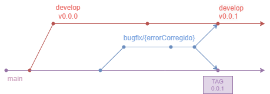

# Rama bugfix

Esta rama se usará para corregir errores en el código en producción. Esta rama no se planifica, se crea si se detecta algún bug en producción, por tanto se crean a partir de la rama `main` y los cambios deben fusionarse (merge) con `main` y `develop`.

Nomenclatura: `bugfix/{errorCorregido}`
> Tras un bug corregido se aumentará el parche de la rama `develop` y la rama `main`, así como el de la *TAG*.
