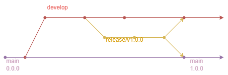

# Release

La rama `release` se utilizará para preparar el siguiente código listo para producción, en ella se harán los últimos ajustes
(archivos de configuración, archivos de librerias, pequeñas correcciones) antes de incorporar el código a la rama `main`. Además los cambios también se incorporarán a la rama `develop`. Al incorporarlo a `main` se
hace etiqueta con una [versión](../../versioning_policy.md).

Nomenclatura: `release/v{versiónDeRelease}`
> La versión de release se corresponde con la versión de la rama develop en el momento que se bifurcó la rama

Ejemplo: ``release/v1.0.0.`` Una vez se realiza el merge con la rama ``develop`` y ``main``,
esta última  pasa a ser ``v1.0.0`` (Además se crea una TAG).
