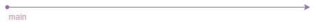

# Estructura del repositorio y ramas por defecto

El objetivo de este apartado y el [siguiente](branching_strat_peer_review/README.md) es mostrar la estructura del repositorio, cómo vamos a aplicar el sistema de ramificación basado en git-flow a nuestro proyecto y la nomenclatura a seguir para cada una de las ramas.

El repositorio de código que usaremos durante todo el proyecto será [GitHub](https://github.com/) que nos va a permitir administrar el proyecto de forma eficiente, ya que permite el visionado de las diferentes versiones del código y nos aporta distintas herramientas de utilidad:

- Revisión de código
- Estadísticas
- Tableros para la aplicación de Scrum
- Y muchas otras funcionalidades más

Cuando se crea un repositorio en GitHub, se crea una sola rama. Esta primera rama es la rama por defecto que GitHub mostrará cuando alguien acceda al repositorio. En nuestro caso la **rama por defecto** será la rama `main`. A parte de esta rama se pueden crear muchas más.

En este apartado hablaremos de las ramas principales:

En el proyecto se usarán dos ramas principales `main` y `develop`:

- `main`: Los commit realizados en esta rama deben estar listos para subir a producción. Se deberá etiquetar cada confirmación de esta rama con un [número de versión](versioning_policy.md).

Nomenclatura: `main`

- `develop`: Servirá como integración para las funciones. Se deberá crear al inicio del proyecto una rama `develop` (a partir de la rama `main`) que contendrá todo el historial completo del proyecto.

Nomenclatura: `develop`
