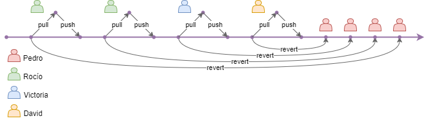

# Antecedentes

Al iniciar el proyecto los desarrolladores comenzaron a realizar las tareas A2.5 (detalladas  en el [siguiente apartado](tareas_realizadas.md)) sin que aparecieran conflictos,  debido a la siguiente causa:

***Se estaba realizando un PULL del repositorio antes de comenzar con la tarea que correspondía.***

Durante este periodo inicial de tiempo los desarrolladores siguieron los siguientes pasos:

1. Hacer **PULL** del repositorio antes de empezar a trabajar.
2. Realizar sus cambios en el código.
3. Hacer **PUSH** al repositorio, para que otros compañeros pudieran bajar sus cambios en el siguiente **PULL**.

De esta forma, el objetivo de la tarea (generar conflictos y solucionarlos) no podía cumplirse, por lo que se decidió realizar **REVERT** de las tareas realizadas hasta el momento y volver a empezar siguiendo las pautas detalladas en el backlog de la asignatura.

A continuación se detalla mediante un esquema los commits realizados:

> ``git revert [hash-commit(s)]``:
Realiza un commit deshaciendo los cambios de un commit o commits en concreto.
Por tanto, en los siguientes apartados de este documento partimos desde este punto, donde a pesar
de haber realizado algunos commits, el proyecto ha vuelto a su estado inicial.
