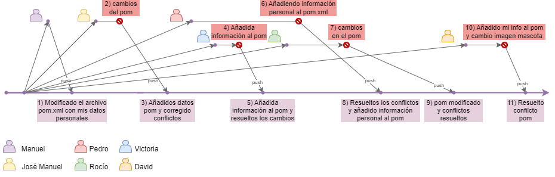
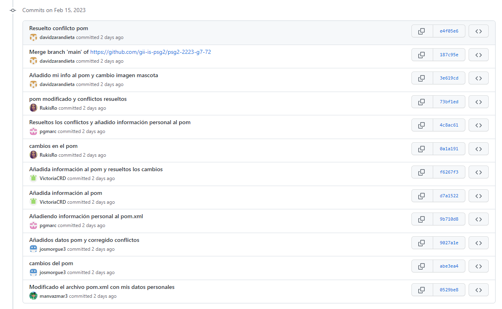
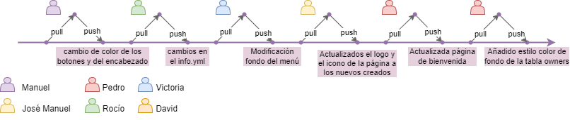

# Historial de cambios A2.5

A continuación se detalla mediante un esquema los cambios realizados en el proyecto, se indica con
un círculo rojo  cada vez que aparece un conflicto y se explica en el 
[apartado siguiente](resolucion_conflictos.md) como se han solucionado:

La imagen muestra los **commits** realizados en **orden cronológico** de izquierda a derecha. Los commits
que presentaron conflictos se representan encuadrados en rojo mientras
que los que no presentaron conflictos se representan encuadrados en morado.

Todos los commits representados en la imagen anterior se realizaron el 15 de febrero de 2023, podemos verlos también en GitHub, ordenados en este caso de forma ascendente:

Además para completar las tareas del apartado A2.5 se realizaron algunas modificaciones más, esta vez sin forzar conflictos y realizando un **PULL** antes de comenzar a realizar cambios en el código local:

