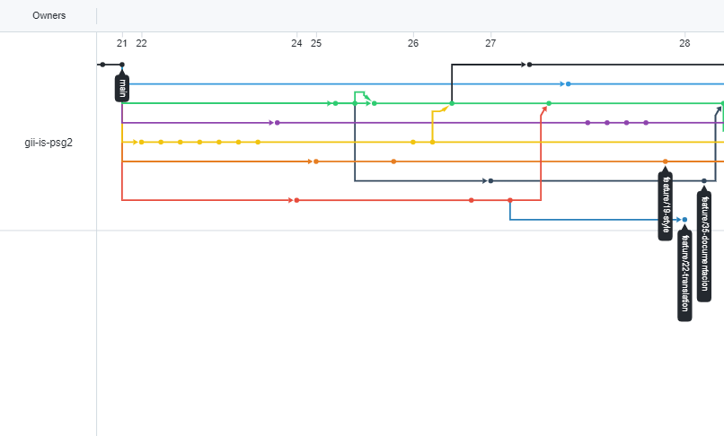
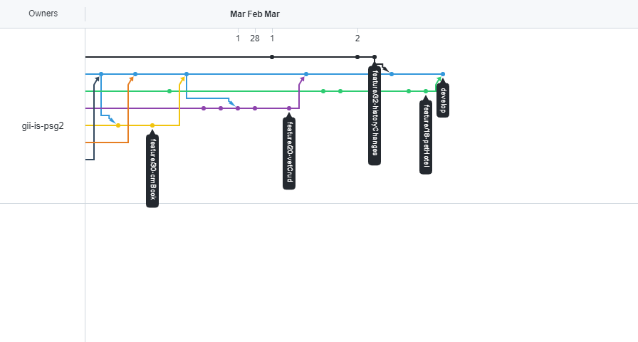
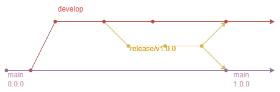

# Historial de cambios A2.8 y A2.9

Para las tareas A2.8 y A2.9 se va a usar la metodología de git-flow. Para ello, se crea una rama feature para cada nueva funcionalidad de la aplicación que se fusiona con la rama ``develop``
(previamente se crea una PULL-REQUEST). Finalmente, una vez todas las funcionalidades están
integradas en la rama ``develop``, se crea a partir de ella una rama ``release``. En esta rama se
corrigen y añaden pequeños cambios. La rama ``release`` se fusiona tanto con la rama ``develop`` como con la rama ``main``, obteniendo así la primera versión productiva de nuestro proyecto.

En las siguientes imágenes se muestra el flujo de trabajo de nuestro proyecto. De la rama ``main`` sacamos la rama ``develop`` (verde) y a partir de ella todas las demás ramas ``feature``, finalmente todas las features terminan fusionadas con la rama ``develop``:

Por último de la rama develop sacamos una rama release que trás realizar varios cambios en ella, fusionamos con main y con develop:

