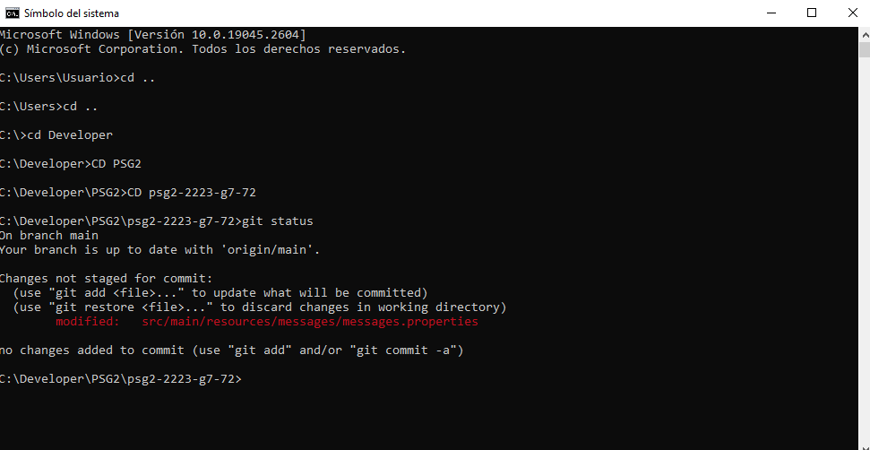
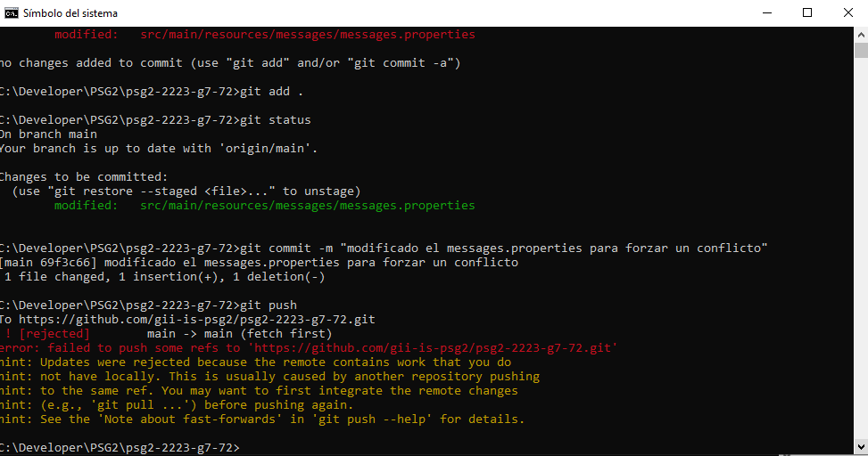
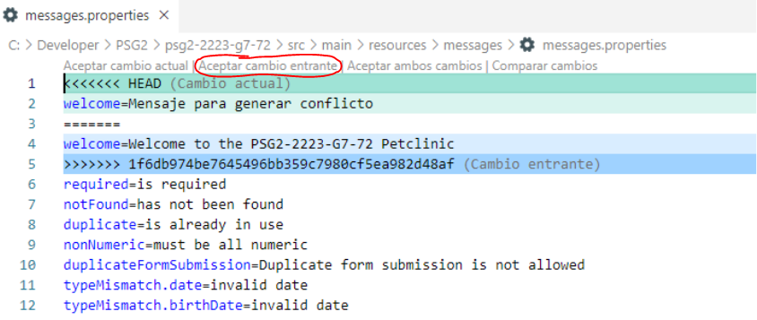
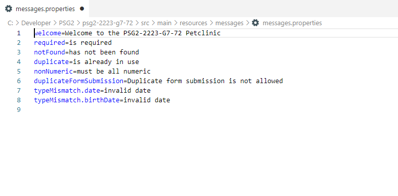
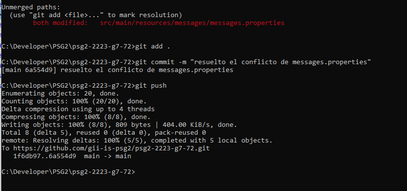

# Resolución de conflictos

A continuación se detalla los pasos seguidos por el equipo para generar conflictos de código:

1. Tras haber realizado un cambio en el código local sin haber hecho **PULL**, realizamos la
siguiente secuencia de comandos:

- `git status`

- ``git add .``
- ``git commit -m "mensaje"``
- ``git push origin main``

Tras hacer el **PUSH** surge un **conflicto** en el código ya que una de las líneas que se ha
modificado en local ya había sido modificada por anterioridad por otro desarrollador,
pero estos cambios no habían sido incluidos en el código local.

- ``git pull origin main``
- `code src/main/resources/messages/messages.properties`

Con este último comando se abre Visual Studio Code, donde se compara el código que
genera el conflicto.
En la parte superior de la ventana se puede aceptar el cambio que corresponda:

- Aceptar cambio actual
- Aceptar cambio entrance
- Aceptar ambos cambios
- Comparar cambios

En este caso se selecciona *Aceptar cambio entrante* para dejar el código como estaba
antes de introducir la modificación:

El código vuelve a ser correcto y ya no tiene conflictos:

2. Se vuelve a realizar la siguiente secuencia de comandos para finalmente añadir los cambios al
repositorio sin que se generen conflictos:

- ``git add .``
- ``git commit -m “mensaje”``
- ``git push``

> Esta prueba se ha realizado para documentar la forma en que el equipo ha resuelto los
conflictos del [apartado anterior](resolucion_conflictos.md),habiendo forzado
el conflicto para tomar capturas del proceso.
Los commits realizados durante la prueba no se van a añadir al historial de cambios.
